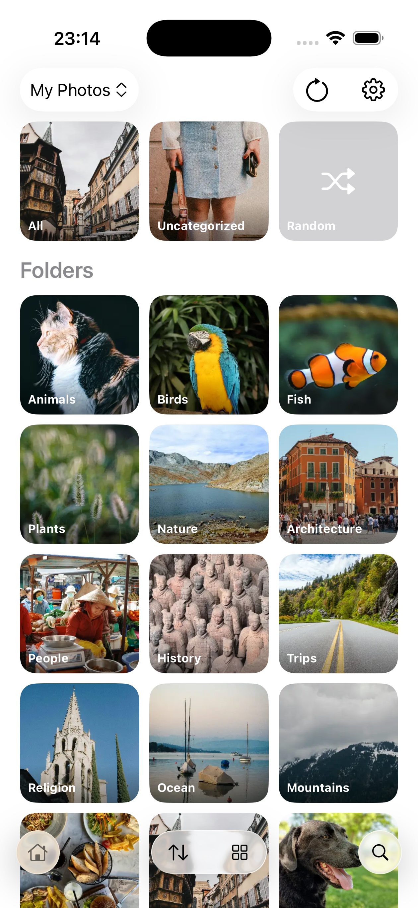

# Eagle Viewer for iOS

An iOS app for viewing [Eagle](https://jp.eagle.cool/) image libraries on iPhone and iPad.

## Screenshots

<table>
<tr>
<td width="33%">

</td>
<td width="33%">

</td>

<td width="33%">

</td>
</tr>
</table>

## Features

- **Access from multiple sources**: Local storage, iCloud Drive, and network shares (NAS)
- **Automatic sync**: Changes made on desktop are reflected immediately
- **Offline browsing**: Cache images for viewing without internet connection

## Contributions

Feel free to create issues and PRs.
